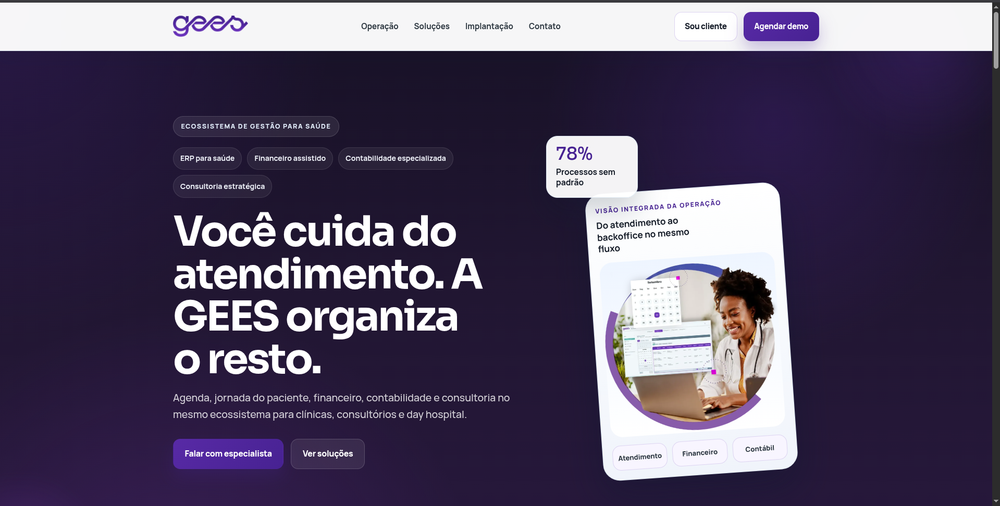
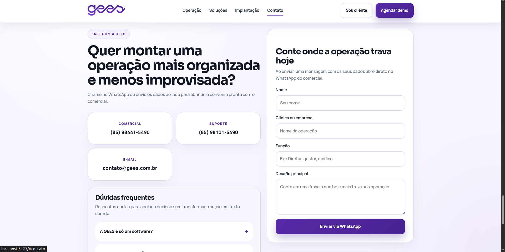
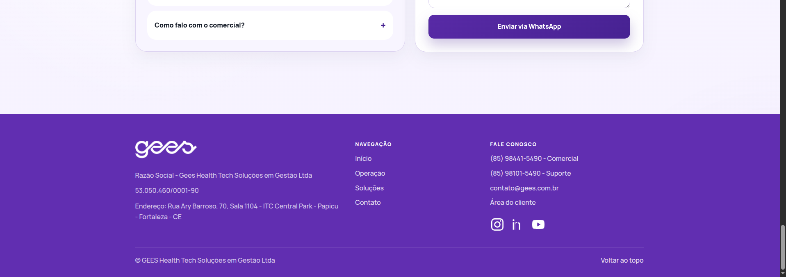

# LP GEES

Landing page institucional da **GEES Healthtech**, desenvolvida para apresentar um ecossistema de gestao para saude que conecta software, financeiro, contabilidade e consultoria em uma mesma experiencia digital.

O foco da pagina e gerar percepcao de valor rapidamente, conduzir o visitante pelos diferenciais da marca e incentivar o contato comercial por meio de CTAs para WhatsApp, area do cliente e canais institucionais.

## Proposta da pagina

- apresentar a GEES como um ecossistema completo para clinicas, consultorios e day hospital
- comunicar servicos e modulos de forma clara e comercial
- destacar dores operacionais do publico-alvo
- conduzir o usuario para agendamento de demonstracao
- reforcar autoridade com uma narrativa mais premium e consultiva

## O que a landing page entrega

- hero principal com posicionamento da marca e CTA comercial
- sessao de prova de valor do ecossistema GEES
- blocos de publico-alvo por estagio da operacao
- leitura de desafios comuns do setor de saude
- apresentacao de modulos e solucoes do portfolio
- jornada de implantacao em etapas
- FAQ comercial
- formulario de captacao integrado ao WhatsApp
- rodape com navegacao, canais de contato e redes sociais

## Stack do projeto

- `React 19`
- `TypeScript`
- `Vite`
- `CSS`

## Como executar

Instale as dependencias:

```bash
npm install
```

Inicie o servidor local:

```bash
npm run dev
```

Para gerar a build de producao:

```bash
npm run build
```

Para visualizar a build localmente:

```bash
npm run preview
```

## Estrutura principal

```text
src/
|- App.tsx        # estrutura principal da landing page
|- App.css        # estilos globais e sessoes visuais
|- assets/        # logos, imagens e artes da GEES

public/
|- screenshots/   # capturas usadas no README
```

## Screenshots

As imagens abaixo mostram a experiencia visual da landing page em pontos-chave da navegacao.

### Tela inicial

<p align="center">
  
</p>

### Bloco de conteudo e prova de valor

<p align="center">
  
</p>

### Rodape e contato

<p align="center">
  
</p>

## Objetivo

A `lp-gees` foi pensada para funcionar como uma vitrine comercial forte: uma pagina capaz de transmitir clareza, sofisticacao e direcionamento de negocio para atrair conversas com potenciais clientes da GEES.
